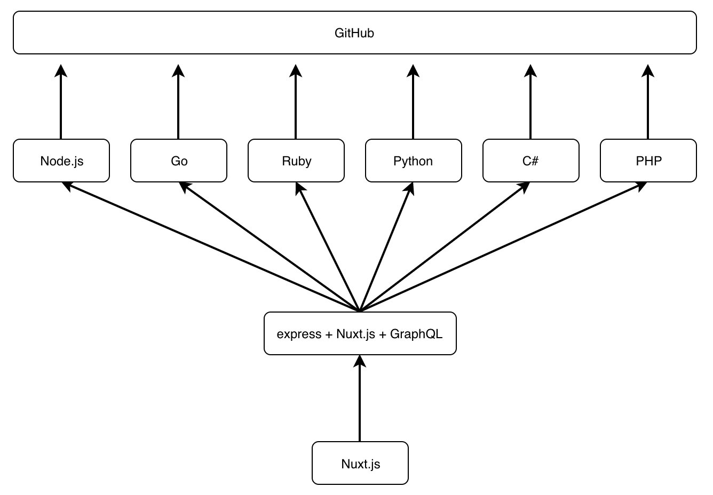
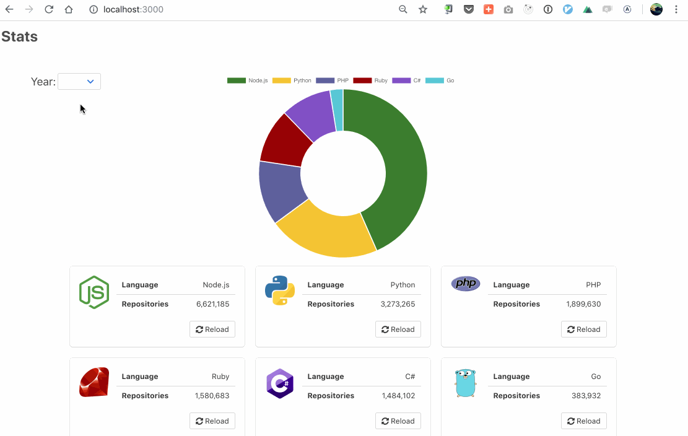

# OpenFaaS Everywhere

This repository tries to show integration with cutting edge technologies such as:

* Kubernetes for containers
* OpenFaaS for functions(every function uses a different language!) and microservices
* Nuxt.js for an SPA with Server Side Rendering
* GraphQL for APIs
* Apollo to communicate with GraphQL

## Overview



## Demo



## Try it yourself

### Requirements

* A Kubernetes cluster with a `nginx` ingress controller
* [OpenFaaS deployed](https://docs.openfaas.com/deployment/kubernetes/)
* The [OpenFaaS CLI](https://docs.openfaas.com/cli/install/) installed
* A GitHub Personal API Token


### Deploy Ingress

Deploy the Ingress for the nuxt app. (The default is set to `nuxt.openfaas.local` which will point to the `faas-nuxt-graphql` microservice)

```bash
kubectl apply -f ./yaml
```


### Set your `/etc/hosts`

Since domains differ from one to another, this instruction sets `/etc/hosts` to fake the Domain resolving. Open your `/etc/hosts` and set it like the following:

```
<YOUR K8S CLUSTER IP> gateway.openfaas.local
<YOUR K8S CLUSTER IP> nuxt.openfaas.local
```


### Prepare the GitHub token

Since the requests to the GitHub API require a GitHub Personal Token, make sure you've already created one. ( `public_repo` is the only permission required)

#### `.env.yml` file

```bash
# create .env.yml
touch .env.yml
```

Paste your GitHub API token inside the file like this:

```yml
environment:
  TOKEN: <PUT YOUR GITHUB API TOKEN HERE>
```


### Deploy the functions

If you're using the images created by the author ( `kenfdev` ), just hit:

```bash
faas-cli deploy
```

And the functions should be deployed.


If you are building them from source, be sure to change the username for docker hub (or wherever your registry is) inside the `stack.yml`.

```yml
...
functions:
  faas-nuxt-graphql:
    lang: dockerfile
    handler: ./faas-nuxt-graphql
    image: kenfdev/faas-nuxt-graphql:latest # <- change the username!
    environment:
      GATEWAY_URL: http://gateway.openfaas:8080
    environment_file:
      - .env.yml
...
```

and then hit:

```bash
faas-cli up
```


## Todo

- [ ] Create `faas-java` for a Java function example
- [ ] Use secrets for the API token injection
- [ ] A better way to inject `API_BASE_URL` in `faas-nuxt-graphql/package.json`
- [ ] Think about a seamless way to develop the nuxt app with `npm run dev`


**Contributions are welcome!**